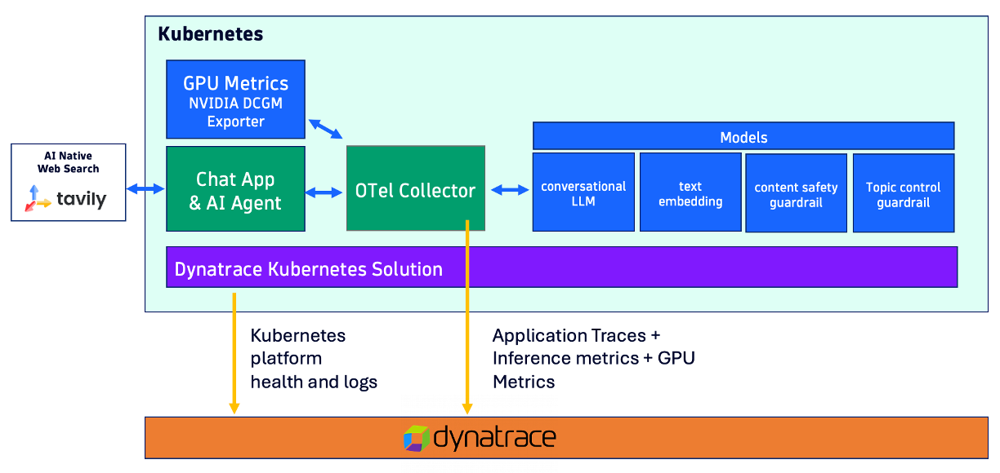

# NIM Guardrails Chat

This chat app demonstrates NVIDIA NeMo Guardrails with NIM model endpoints. The app supports input safety rails (jailbreak detection, blocked terms, input length, politics filtering) and exports traces via OpenTelemetry.

The chat app was built using:
* [NVIDIA NeMo Agent Toolkit](https://docs.nvidia.com/nemo/agent-toolkit/) and 
* NVIDIA [NeMo Guardrails](https://github.com/NVIDIA/NeMo-Guardrails). 
* [streamlit](https://www.streamlit.io) open-source app framework

All of the observability telemetry of traces, logs, and metrics are collected using the [Dynatrace distribution of the OpenTelemetry Collector](https://docs.dynatrace.com/docs/ingest-from/opentelemetry/collector) for analysis within [Dynatrace](https://www.dynatrace.com).

This diagram below depicts the setup consisting of:
* Chat app - Used to generate prompts and send telemetry data to and OpenTelemetry Collector
* OpenTelemetry Collector - Configured to send telemetry data to Dynatrace OTLP APIs
* LLM models - Locally hosted
* Tavily - Uses as Agentic tool to search the internet and accessed via APIs and a Build API key
* Dynatrace - Observability and analysis



## Prerequisites

- NVIDIA API key from [build.nvidia.com](https://build.nvidia.com)
- Tavily API key (used for web search)
- Dynatrace OTel ingest endpoint and API token (for tracing)

## Models Used

* `google/gemma-4-31b-it` — The main conversational LLM, used for the NAT tool-calling agent workflow and the `check_politics` guardrail. Called via the NVIDIA cloud API (`integrate.api.nvidia.com`).
* `nvidia/nemotron-3.5-content-safety` — The safety classifier used for both content safety guardrails (detecting harmful or unsafe input/output) and topic control guardrails (blocking political content). Runs on both input and output rails.
* `nvidia/nv-embedqa-e5-v5` — The embedding model used by the NAT workflow for semantic search and retrieval.

# Running the App

The application support multiple options to run, deploy, and what LLM models to use.
* LLM Models - locally hosted or cloud hosted
* Deployment - with Docker or in K8s

## Deployment Option :: Docker with Cloud Hosted

Create a `.env` file:

```
CONFIG_TYPE=build
NVIDIA_API_KEY=nvapi-<your-key>
TAVILY_API_KEY=tvly-<your-key>
SERVICE_NAME=nim-guardrails-chat
# Enable tracing (optional):
#OTEL_OTLP_ENDPOINT=http://host.docker.internal:4318
# Or disable OTel entirely:
OTEL_SDK_DISABLED=true
```

Detached (background):
```bash
docker run -d \
  --name nim-guardrails-chat \
  -p 8501:8501 \
  --env-file .env \
  nim-guardrails-chat
```

Interactive (logs printed to terminal, useful for debugging):
```bash
docker run -it --rm \
  --name nim-guardrails-chat \
  -p 8501:8501 \
  --env-file .env \
  nim-guardrails-chat
```

The app will be available at `http://localhost:8501`.

# Building the app

Run from inside this directory:

```bash
docker build -t nim-guardrails-chat .
```
